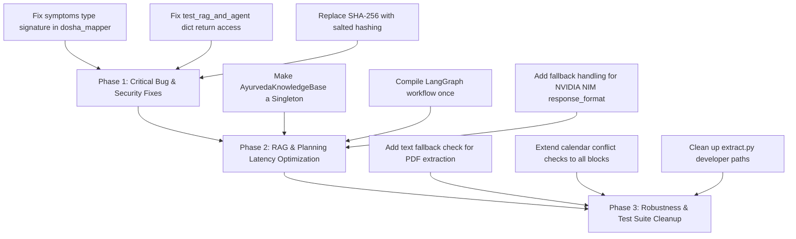

# AiDincharya Codebase Deep Diagnosis & Architecture Report

> **Diagnosis Date:** August 19, 2026  
> **Target Repository:** `AIDincharya-main`  
> **Repository Type:** AI Personalization Backend & Web Application (Ayurvedic Routine Automation)  
> **Analysis Mode:** Non-destructive Deep Diagnostic Audit (No codebase modifications made)

---

## 1. Executive Summary

**AiDincharya** is an ambitious, domain-specific AI system designed to automate personalized Ayurvedic daily routine planning (*Dinacharya*). The codebase integrates:
- **Perception Layer:** Rule-based tri-dosha phenotypic mapping and rolling wearable telemetry anomaly detection.
- **Knowledge RAG Layer:** Vector database retrieval (ChromaDB + SentenceTransformers) over authentic classical texts.
- **Agentic Planning Layer:** Multi-stage Plan-and-Execute workflow (LangGraph) powered by LLM endpoints (NVIDIA NIM / Puter AI).
- **Behavior & Guardrail Layer:** Closed-loop adherence scoring, adaptive complexity scaling, and symbolic clinical safety overrides.
- **Backend & Frontend:** FastAPI REST API with SQLite persistence and a static web portal.

### Overall System Health Score: `6.5 / 10`

While the architectural blueprint is solid and cleanly domain-separated, the implementation contains **critical runtime bugs**, **severe performance bottlenecks**, **security vulnerabilities**, and **test suite flaws** that can cause unexpected crashes or degraded latency in production.

---

## 2. Comprehensive Issue Matrix

| Category | Issue Title | Severity | Impact | Location |
| :--- | :--- | :--- | :--- | :--- |
| **Bug** | `detect_vikriti` List vs Dict Type Mismatch | **CRITICAL** | `AttributeError` crash when symptoms passed as List | [dosha_mapper.py](file:///c:/Users/Shreyansh/Desktop/AIDincharya-main/AIDincharya-main/src/perception/dosha_mapper.py#L46-L68) |
| **Bug** | Diagnostic Script Execution Failure | **HIGH** | `AttributeError` crash on dictionary return type | [test_rag_and_agent.py](file:///c:/Users/Shreyansh/Desktop/AIDincharya-main/AIDincharya-main/test_rag_and_agent.py#L57) |
| **Bug** | RAG PDF Ingestion `NoneType` Concatenation | **HIGH** | Ingestion crash on empty/scanned PDF pages | [retriever.py](file:///c:/Users/Shreyansh/Desktop/AIDincharya-main/AIDincharya-main/src/knowledge/retriever.py#L45-L46) |
| **Bug** | Safety Engine Object Reference Mutation | **MEDIUM** | Inconsistent practice times & reference leak | [guardrails.py](file:///c:/Users/Shreyansh/Desktop/AIDincharya-main/AIDincharya-main/src/safety/guardrails.py#L94-L96) |
| **Bug** | Dosha Vector Normalization Precision Loop | **MEDIUM** | Inexact floating point sum validation failure | [models.py](file:///c:/Users/Shreyansh/Desktop/AIDincharya-main/AIDincharya-main/src/models.py#L14-L21) |
| **Bug** | SQLite UTC Date Shift in Adherence Tracking | **MEDIUM** | Late-night completions logged on wrong day | [db.py](file:///c:/Users/Shreyansh/Desktop/AIDincharya-main/AIDincharya-main/src/database/db.py#L79) |
| **Performance** | SentenceTransformer/ChromaDB Re-init on Every RAG Call | **CRITICAL** | Adds 2–8 seconds latency per tool call | [tools.py](file:///c:/Users/Shreyansh/Desktop/AIDincharya-main/AIDincharya-main/src/planning/tools.py#L57) |
| **Performance** | Per-Request LangGraph Compilation | **MEDIUM** | Redundant graph compilation overhead | [agent.py](file:///c:/Users/Shreyansh/Desktop/AIDincharya-main/AIDincharya-main/src/planning/agent.py#L271) |
| **Performance** | Synchronous Database DDL on Import | **LOW** | Module import side-effects and DB locking | [db.py](file:///c:/Users/Shreyansh/Desktop/AIDincharya-main/AIDincharya-main/src/database/db.py#L233) |
| **Security** | Unsalted SHA-256 Password Hashing | **HIGH** | Vulnerable to rainbow table & dictionary attacks | [main.py](file:///c:/Users/Shreyansh/Desktop/AIDincharya-main/AIDincharya-main/main.py#L93) |
| **Security** | Unexpiring Cleartext Session Tokens | **HIGH** | No token expiration or revocation mechanics | [db.py](file:///c:/Users/Shreyansh/Desktop/AIDincharya-main/AIDincharya-main/src/database/db.py#L115) |
| **Security** | Invalid CORS Configuration | **MEDIUM** | Browser credential blocking on wildcard origin | [main.py](file:///c:/Users/Shreyansh/Desktop/AIDincharya-main/AIDincharya-main/main.py#L34-L40) |
| **Code Quality**| Developer Environment Artifacts (`extract.py`) | **LOW** | Hardcoded local user paths in repo root | [extract.py](file:///c:/Users/Shreyansh/Desktop/AIDincharya-main/AIDincharya-main/extract.py#L4-L5) |
| **Code Quality**| Incomplete Calendar Overlap Resolution | **LOW** | Executor skips midday & evening blocks | [agent.py](file:///c:/Users/Shreyansh/Desktop/AIDincharya-main/AIDincharya-main/src/planning/agent.py#L207-L219) |

---

## 3. Deep-Dive Diagnostic Analysis

### 3.1. Bugs & Functional Defects

#### 1. `detect_vikriti` List vs. Dict Type Signature Mismatch
* **Location:** [`src/perception/dosha_mapper.py` (Lines 46–68)](file:///c:/Users/Shreyansh/Desktop/AIDincharya-main/AIDincharya-main/src/perception/dosha_mapper.py#L46-L68)
* **Diagnosis:**  
  The function parameter is typed as `symptoms: Optional[Dict[str, str]] = None`, and iterates via:
  ```python
  if symptoms:
      for s_name, s_val in symptoms.items():
          s_lower = s_val.lower()
  ```
  However, in [`src/models.py`](file:///c:/Users/Shreyansh/Desktop/AIDincharya-main/AIDincharya-main/src/models.py#L52), `UserContext.self_report_symptoms` is defined as a `List[str]`. If an caller passes a list of strings directly, `symptoms.items()` raises:
  `AttributeError: 'list' object has no attribute 'items'`
* **Current Workaround:** [`main.py`](file:///c:/Users/Shreyansh/Desktop/AIDincharya-main/AIDincharya-main/main.py#L208-L210) manually maps the list into a dictionary (`{"symptom_0": "fever", ...}`). But direct function invocations elsewhere in tests or background jobs will crash.

#### 2. Broken Diagnostic Test Script
* **Location:** [`test_rag_and_agent.py` (Line 57)](file:///c:/Users/Shreyansh/Desktop/AIDincharya-main/AIDincharya-main/test_rag_and_agent.py#L57)
* **Diagnosis:**  
  `DinacharyaPlannerAgent.generate()` returns a dictionary: `{"schedule": DinacharyaSchedule, "retrieved_guidelines": [...]}`.
  Line 57 in `test_rag_and_agent.py` attempts:
  ```python
  for p in schedule.morning_block:
  ```
  Since `schedule` is the returned dictionary, this throws `AttributeError: 'dict' object has no attribute 'morning_block'`, rendering the standalone test script unusable.

#### 3. RAG PDF Text Extraction Crash Risk
* **Location:** [`src/knowledge/retriever.py` (Lines 45–46)](file:///c:/Users/Shreyansh/Desktop/AIDincharya-main/AIDincharya-main/src/knowledge/retriever.py#L45-L46)
* **Diagnosis:**  
  In `_ingest_pdf()`:
  ```python
  for page in pdf_reader.pages:
      text += page.extract_text()
  ```
  `pypdf`'s `page.extract_text()` returns `None` for scanned pages, image pages, or empty pages. String concatenation `text += None` triggers a fatal `TypeError`.

#### 4. Safety Engine Reference Mutation & Logic Flaw
* **Location:** [`src/safety/guardrails.py` (Lines 94–96)](file:///c:/Users/Shreyansh/Desktop/AIDincharya-main/AIDincharya-main/src/safety/guardrails.py#L94-L96)
* **Diagnosis:**  
  - Line 95 contains: `replacement.time_slot = "06:30 - 07:00" if block and block == cleaned_block else replacement.time_slot`. When items are removed from `block`, `cleaned_block` has a different size, so `block == cleaned_block` is `False`.
  - The same `replacement` object reference is passed to `morning_block`, `midday_block`, and `evening_block`. Mutating `replacement.time_slot` overwrites the same object across all three schedule blocks.

#### 5. Dosha Vector Normalization Decimal Rounding Issue
* **Location:** [`src/models.py` (Lines 14–21)](file:///c:/Users/Shreyansh/Desktop/AIDincharya-main/AIDincharya-main/src/models.py#L14-L21)
* **Diagnosis:**  
  `DoshaVector.normalize_vector` checks `if total > 0 and abs(total - 1.0) > 1e-4:` and rounds components to 3 decimal places (`round(self.vata / total, 3)`).
  Dividing and rounding three equal scores yields `0.333 + 0.333 + 0.333 = 0.999`. The sum remains `0.999`, which still violates `abs(total - 1.0) <= 0.0001`, leaving the vector slightly unnormalized.

---

### 3.2. Performance & Latency Bottlenecks

#### 1. RAG Model Re-Initialization Overhead (High Latency)
* **Location:** [`src/planning/tools.py` (Line 57)](file:///c:/Users/Shreyansh/Desktop/AIDincharya-main/AIDincharya-main/src/planning/tools.py#L57)
* **Diagnosis:**  
  `query_ayurvedic_knowledge()` instantiates `kb = AyurvedaKnowledgeBase()` on **every call**.
  Instantiating `AyurvedaKnowledgeBase`:
  1. Loads `SentenceTransformerEmbeddingFunction('all-MiniLM-L6-v2')` into memory.
  2. Opens a disk connection via `chromadb.PersistentClient`.
  3. Checks collection count.
  This adds **2.0s to 8.0s of latency per RAG search**, creating noticeable delays during schedule planning.

#### 2. Per-Request LangGraph Compilation
* **Location:** [`src/planning/agent.py` (Line 271)](file:///c:/Users/Shreyansh/Desktop/AIDincharya-main/AIDincharya-main/src/planning/agent.py#L271)
* **Diagnosis:**  
  `DinacharyaPlannerAgent.generate()` invokes `self.build_graph()` on every execution request. StateGraph compilation should occur once in `__init__` or at module scope.

#### 3. Database Execution at Import Time
* **Location:** [`src/database/db.py` (Line 233)](file:///c:/Users/Shreyansh/Desktop/AIDincharya-main/AIDincharya-main/src/database/db.py#L233)
* **Diagnosis:**  
  `init_db()` runs unconditionally upon importing `src.database.db`. In multi-threaded ASGI/Uvicorn setups, import-side-effect DDL commands can cause database locks or schema race conditions.

---

### 3.3. Security & Compliance Vulnerabilities

#### 1. Unsalted Passwords
* **Location:** [`main.py` (Lines 93 & 102)](file:///c:/Users/Shreyansh/Desktop/AIDincharya-main/AIDincharya-main/main.py#L93)
* **Diagnosis:**  
  Passwords are hashed with standard SHA-256 (`hashlib.sha256(password.encode()).hexdigest()`) without unique salts or adaptive work factors (such as `bcrypt` or `argon2`).

#### 2. Unexpiring Session Tokens
* **Location:** [`src/database/db.py` (Lines 31–37, 115–121)](file:///c:/Users/Shreyansh/Desktop/AIDincharya-main/AIDincharya-main/src/database/db.py#L31-L37)
* **Diagnosis:**  
  Tokens generated via `secrets.token_urlsafe(32)` are stored in SQLite without `created_at` expiration checks or token refresh/logout mechanics. Compromised tokens remain valid indefinitely.

#### 3. Permissive CORS Middleware Configuration
* **Location:** [`main.py` (Lines 34–40)](file:///c:/Users/Shreyansh/Desktop/AIDincharya-main/AIDincharya-main/main.py#L34-L40)
* **Diagnosis:**  
  `allow_origins=["*"]` combined with `allow_credentials=True` violates CORS specifications and is rejected by modern browsers for authenticated requests.

---

### 3.4. Code Quality & Repository Cleanliness

1. **Leftover Developer Script:** [`extract.py`](file:///c:/Users/Shreyansh/Desktop/AIDincharya-main/AIDincharya-main/extract.py#L4-L5) contains hardcoded user directory paths (`/Users/Siddharth/...`) and should be moved to scratch or removed from production builds.
2. **Incomplete Calendar Overlap Checking:** [`src/planning/agent.py`](file:///c:/Users/Shreyansh/Desktop/AIDincharya-main/AIDincharya-main/src/planning/agent.py#L207-L219) only iterates through `morning_block` for conflict resolution, ignoring `midday_block` and `evening_block`.
3. **Naïve Substring Matching in Perception:** [`src/perception/dosha_mapper.py`](file:///c:/Users/Shreyansh/Desktop/AIDincharya-main/AIDincharya-main/src/perception/dosha_mapper.py#L26-L33) uses simple substring checks like `"dry" in val`. Input phrases such as `"skin is not dry"` will be misclassified as Vata.

---

## 4. Recommended Remediation Roadmap



### High-Priority Action Items (P0)
1. **Unify `symptoms` Parameter Types:** Update `detect_vikriti` in `dosha_mapper.py` to accept `Union[List[str], Dict[str, str]]` safely.
2. **Reuse RAG Retriever Instance:** Modify `query_ayurvedic_knowledge` in `tools.py` to use a global singleton instance of `AyurvedaKnowledgeBase` instead of re-instantiating on every query.
3. **Fix `test_rag_and_agent.py`:** Update line 57 to access `schedule["schedule"].morning_block`.
4. **Implement Salted Password Hashing:** Replace plain SHA-256 with `passlib` / `bcrypt` / `pbkdf2`.

---

*Report generated by Antigravity AI Code Analysis Engine.*
